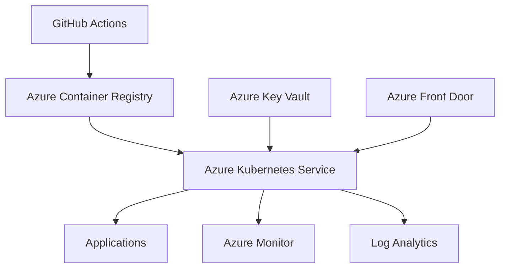

# ☁️ Azure AKS Platform

> Enterprise-grade Kubernetes platform on Microsoft Azure using AKS, Terraform, Azure Key Vault, Front Door, GitHub Actions and Observability.

---

## 🎯 Project Goal

Demonstrate how to build a secure, scalable and production-ready AKS platform following modern DevOps and Platform Engineering practices.

## 🏗 Architecture

## ⚙️ Core Components

- Azure Kubernetes Service (AKS)
- Azure Key Vault
- Azure Front Door
- Azure Monitor
- Log Analytics
- Terraform
- GitHub Actions
- Workload Identity

## 🔐 Security Features

- Managed Identity
- Azure Key Vault Integration
- Secret Rotation
- RBAC
- Private Networking
- WAF Integration

## 📊 Observability

- Azure Monitor
- Log Analytics
- OpenTelemetry
- Centralized Logging
- Application Monitoring

## 📈 Business Value

- Enterprise-grade AKS deployment
- Secure secrets management
- Automated deployments
- Multi-environment platform architecture
- Centralized monitoring and logging

## 🗺 Roadmap

- [ ] Terraform AKS Modules
- [ ] Azure Networking
- [ ] Azure Key Vault Integration
- [ ] GitHub Actions Pipeline
- [ ] Monitoring Stack
- [ ] Security Baseline
- [ ] Multi-Environment Deployment Strategy

## 👨‍💻 Author

Kanakaraj Vetti
DevOps Engineer | AWS | Azure | Kubernetes